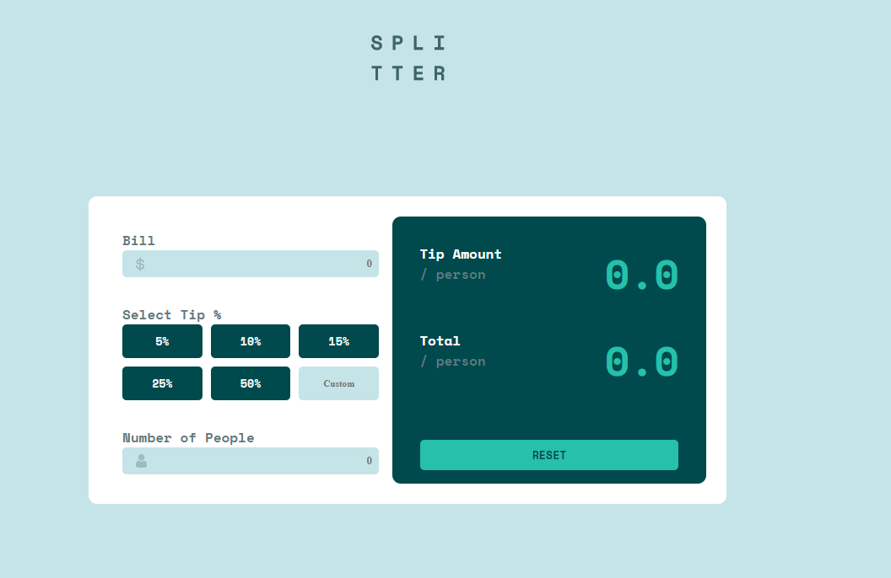

# Frontend Mentor - Tip calculator app solution

This is a solution to the [Tip calculator app challenge on Frontend Mentor](https://www.frontendmentor.io/challenges/tip-calculator-app-ugJNGbJUX). Frontend Mentor challenges help you improve your coding skills by building realistic projects.

## Table of contents

-   [Overview](#overview)
    -   [The challenge](#the-challenge)
    -   [Screenshot](#screenshot)
    -   [Links](#links)
-   [My process](#my-process)
    -   [Built with](#built-with)
    -   [What I learned](#what-i-learned)
    -   [Continued development](#continued-development)
    -   [Useful resources](#useful-resources)
-   [Author](#author)
-   [Acknowledgments](#acknowledgments)

**Note: Delete this note and update the table of contents based on what sections you keep.**

## Overview

### The challenge

Users should be able to:

-   View the optimal layout for the app depending on their device's screen size
-   See hover states for all interactive elements on the page
-   Calculate the correct tip and total cost of the bill per person

### Screenshot



### Links

-   Solution URL: [frontend mentor](https://www.frontendmentor.io/solutions/calculator-tip-htmlcss-and-javascript-_jwtnBnZX)
-   Live Site URL: [calculator-tip](https://calculator-tip.netlify.app/)

## My process

### Built with

-   CSS custom properties
-   Flexbox
-   CSS Grid
-   Mobile-first workflow

### What I learned

```html
<h1>
    I learned how to avoid to break the layout with responsivity, limiting the
    box size and height so that won't break
</h1>
```

```css
.btn:hover {
    filter: brightness(1.2); /*In the use of the propertie filter*/
}
@media (max-width: 500px) {/*Practice of the use of responsivity*/
    .container {
        flex-direction: column;
        margin-top: 11rem;
        padding: 0;
        height: 80%;
        justify-content: center;
        width: 100vh;
        align-items: center;
        border-radius: 30px;
    }
```

```js
// basically everything of the javascript in this project
bill.oninput = function (event) {
    totalBill = event.target.value;
    billInp.classList.add("invisible");
    calcular();
};
```

## Author

-   Frontend Mentor - [@leandromendes25](https://www.frontendmentor.io/profile/leandromendes25)
-   linkedin - [@leandromendes](https://www.linkedin.com/in/leandro-mendes1568/)
    )
